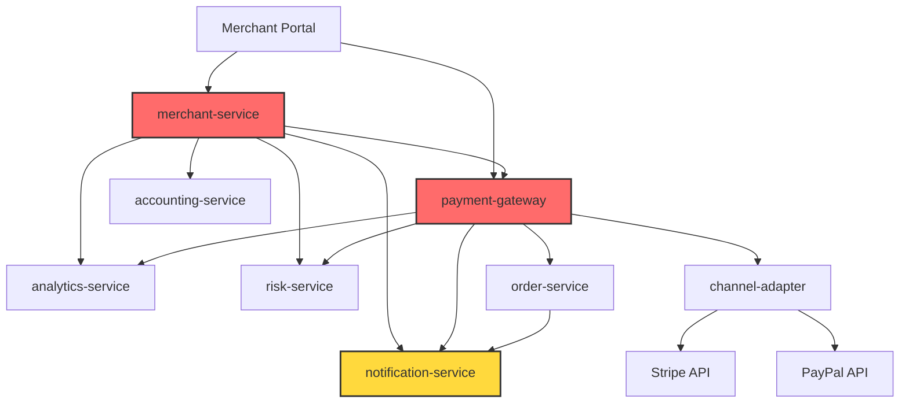
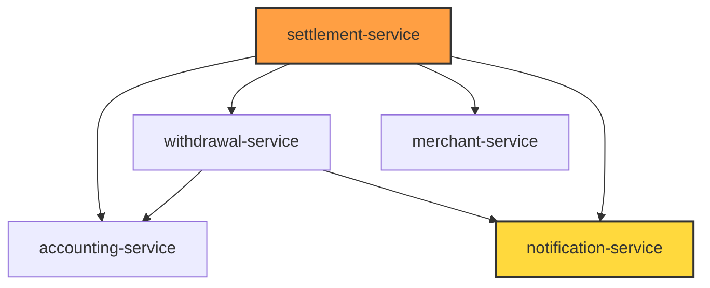

# 微服务依赖关系可视化图谱

> **生成时间**: 2025-10-24
> **可视化工具**: ASCII Art + Mermaid

---

## 📊 1. 完整依赖关系图（层次化视图）

```
┌─────────────────────────────────────────────────────────────────────────────────┐
│                              🌐 外部接入层                                      │
├─────────────────────────────────────────────────────────────────────────────────┤
│                                                                                 │
│  ┌──────────────┐     ┌──────────────┐     ┌──────────────┐                   │
│  │ Merchant     │     │  Admin       │     │  End User    │                   │
│  │ Portal       │     │  Portal      │     │  (Cashier)   │                   │
│  │ :5174        │     │  :5173       │     │  :5175       │                   │
│  └──────┬───────┘     └──────┬───────┘     └──────┬───────┘                   │
│         │                    │                    │                            │
│         ▼                    ▼                    ▼                            │
└─────────┼────────────────────┼────────────────────┼─────────────────────────────┘
          │                    │                    │
          │                    │                    │
┌─────────┼────────────────────┼────────────────────┼─────────────────────────────┐
│         │         🔴 核心编排层 (高耦合 - 需要解耦)                              │
├─────────┼────────────────────┼────────────────────┼─────────────────────────────┤
│         │                    │                    │                            │
│         ▼                    ▼                    ▼                            │
│  ┌──────────────────┐  ┌──────────────┐  ┌──────────────┐                    │
│  │ merchant-service │  │ admin-service│  │ cashier      │                    │
│  │ :40002           │  │ :40001       │  │ :40016       │                    │
│  │ 🔴 扇出: 5       │  │ ✅ 扇出: 0   │  │ ✅ 扇出: 1   │                    │
│  └────────┬─────────┘  └──────────────┘  └──────┬───────┘                    │
│           │                                      │                            │
│           ├─→ analytics-service                  │                            │
│           ├─→ accounting-service                 │                            │
│           ├─→ risk-service                       │                            │
│           ├─→ notification-service               │                            │
│           └─→ payment-gateway ⚠️                 │                            │
│                       │                          │                            │
│                       ▼                          │                            │
│              ┌──────────────────┐                │                            │
│              │ payment-gateway  │◀───────────────┘                            │
│              │ :40003           │                                             │
│              │ 🔴 扇出: 5       │                                             │
│              └────────┬─────────┘                                             │
│                       │                                                       │
│                       ├─→ order-service                                       │
│                       ├─→ channel-adapter                                     │
│                       ├─→ risk-service ⚠️                                     │
│                       ├─→ notification-service ⚠️                             │
│                       └─→ analytics-service ⚠️                                │
│                                                                               │
└───────────────────────────────────────────────────────────────────────────────┘
                          │
                          ▼
┌───────────────────────────────────────────────────────────────────────────────┐
│                     🟠 业务服务层 (中耦合)                                     │
├───────────────────────────────────────────────────────────────────────────────┤
│                                                                               │
│  ┌──────────────────┐         ┌──────────────────┐                           │
│  │ order-service    │         │ settlement       │                           │
│  │ :40004           │         │ :40013           │                           │
│  │ ✅ 扇出: 1       │         │ 🟠 扇出: 4       │                           │
│  └────────┬─────────┘         └────────┬─────────┘                           │
│           │                            │                                     │
│           └─→ notification             ├─→ accounting-service                │
│                                        ├─→ withdrawal-service                │
│                                        ├─→ merchant-service                  │
│                                        └─→ notification-service              │
│                                                                               │
│  ┌──────────────────┐         ┌──────────────────┐                           │
│  │ withdrawal       │         │ kyc-service      │                           │
│  │ :40014           │         │ :40015           │                           │
│  │ ✅ 扇出: 2       │         │ ✅ 扇出: 1       │                           │
│  └────────┬─────────┘         └────────┬─────────┘                           │
│           │                            │                                     │
│           ├─→ accounting-service       └─→ notification-service              │
│           └─→ notification-service                                           │
│                                                                               │
│  ┌──────────────────┐         ┌──────────────────┐                           │
│  │ merchant-auth    │         │ merchant-config  │                           │
│  │ :40011           │         │ :40012           │                           │
│  │ ✅ 扇出: 1       │         │ ✅ 扇出: 0       │                           │
│  └────────┬─────────┘         └──────────────────┘                           │
│           │                                                                   │
│           └─→ merchant-service                                                │
│                                                                               │
└───────────────────────────────────────────────────────────────────────────────┘
                          │
                          ▼
┌───────────────────────────────────────────────────────────────────────────────┐
│                     ✅ 基础服务层 (无依赖 - 理想状态)                          │
├───────────────────────────────────────────────────────────────────────────────┤
│                                                                               │
│  ┌──────────────────┐  ┌──────────────────┐  ┌──────────────────┐           │
│  │ accounting       │  │ analytics        │  │ risk-service     │           │
│  │ :40007           │  │ :40009           │  │ :40006           │           │
│  │ ✅ 被调用: 3次   │  │ ✅ 被调用: 2次   │  │ ✅ 被调用: 2次   │           │
│  │ ✅ 扇出: 0       │  │ ✅ 扇出: 0       │  │ ✅ 扇出: 0       │           │
│  └──────────────────┘  └──────────────────┘  └──────────────────┘           │
│                                                                               │
│  ┌──────────────────┐  ┌──────────────────┐  ┌──────────────────┐           │
│  │ notification     │  │ channel-adapter  │  │ config-service   │           │
│  │ :40008           │  │ :40005           │  │ :40010           │           │
│  │ ⭐ 被调用: 5次   │  │ ✅ 被调用: 1次   │  │ ✅ 被调用: 0次   │           │
│  │ ✅ 扇出: 0       │  │ ✅ 扇出: 0       │  │ ✅ 扇出: 0       │           │
│  └──────────────────┘  └──────────────────┘  └──────────────────┘           │
│                              │                                                │
│                              └─→ 外部: Stripe/PayPal API                      │
│                                                                               │
└───────────────────────────────────────────────────────────────────────────────┘
```

**图例**：
- 🔴 高耦合（扇出 ≥ 4）
- 🟠 中耦合（扇出 2-3）
- ✅ 低耦合（扇出 0-1）
- ⚠️ 重复依赖（多个服务调用同一个服务）
- ⭐ 热点服务（被多次依赖）

---

## 🔴 2. 问题依赖热力图

```
服务扇出热力图（越红越危险）:

┌─────────────────────────────────────────┐
│ payment-gateway      █████ (5)  🔴 高   │
│ merchant-service     █████ (5)  🔴 高   │
│ settlement-service   ████  (4)  🟠 中高 │
│ withdrawal-service   ██    (2)  🟢 低   │
│ order-service        █     (1)  🟢 低   │
│ merchant-auth        █     (1)  🟢 低   │
│ kyc-service          █     (1)  🟢 低   │
│ cashier-service      █     (1)  🟢 低   │
│ 其他服务             ░     (0)  ✅ 优秀 │
└─────────────────────────────────────────┘

服务被依赖热力图（越热越关键）:

┌─────────────────────────────────────────┐
│ notification-service █████ (5)  ⭐ 热点 │
│ accounting-service   ███   (3)  🟠 常用 │
│ analytics-service    ██    (2)  🟢 正常 │
│ risk-service         ██    (2)  🟢 正常 │
│ merchant-service     ██    (2)  🟢 正常 │
│ payment-gateway      █     (1)  🟢 正常 │
│ channel-adapter      █     (1)  🟢 正常 │
│ order-service        █     (1)  🟢 正常 │
│ withdrawal-service   █     (1)  🟢 正常 │
│ 其他服务             ░     (0)  ⚠️ 未用 │
└─────────────────────────────────────────┘
```

---

## ⚠️ 3. 循环依赖风险分析

### 3.1 潜在循环依赖路径

```
【路径 1】merchant-service ↔ payment-gateway (高风险)

merchant-service ─────→ payment-gateway (查询支付)
       ↑                       │
       │                       ↓
       │              analytics-service
       │                       ↑
       └───────────────────────┘ (都依赖 analytics)

⚠️ 虽然目前没有直接循环，但存在"扇入扇出"耦合
⚠️ 未来 payment-gateway 可能需要调用 merchant-service


【路径 2】settlement-service ↔ withdrawal-service (中风险)

settlement-service ─────→ withdrawal-service (触发提现)
       ↑                         │
       │                         ↓
       └────────────── (未来可能需要回调 settlement)

⚠️ 提现完成后，withdrawal 可能需要通知 settlement
⚠️ 建议使用事件驱动解耦
```

### 3.2 避免循环依赖的规则

1. **分层原则**：编排层 → 业务层 → 基础层（单向依赖）
2. **事件解耦**：异步回调使用 Kafka 事件
3. **依赖倒置**：通过接口解耦，不直接依赖实现

---

## 📊 4. Mermaid 流程图（可复制到文档）

### 4.1 支付流程依赖图



### 4.2 结算流程依赖图



---

## ✅ 5. 改造后的理想依赖关系

### 5.1 引入 BFF 层后

```
┌────────────────────────────────────────────────────────┐
│                  前端层                                │
├────────────────────────────────────────────────────────┤
│  Merchant Portal → merchant-bff :40017  (新增 BFF 层)  │
│  Admin Portal    → admin-service :40001                │
│  Cashier         → cashier-service :40016              │
└────────────────────┬───────────────────────────────────┘
                     │
                     ▼
┌────────────────────────────────────────────────────────┐
│                  BFF 聚合层 (新增)                     │
├────────────────────────────────────────────────────────┤
│  merchant-bff :40017                                   │
│    ├─→ analytics-service (统计)                        │
│    ├─→ accounting-service (余额)                       │
│    ├─→ payment-gateway (支付)                          │
│    ├─→ notification-service (通知)                     │
│    └─→ merchant-service (商户信息)                     │
└────────────────────┬───────────────────────────────────┘
                     │
                     ▼
┌────────────────────────────────────────────────────────┐
│                  业务服务层                            │
├────────────────────────────────────────────────────────┤
│  merchant-service :40002 (简化后)                      │
│    扇出: 0 ✅ (只管商户 CRUD，不再聚合)                │
│                                                        │
│  payment-gateway :40003                                │
│    ├─→ order-service                                   │
│    ├─→ channel-adapter                                 │
│    ├─→ risk-service                                    │
│    └─→ [Kafka事件] → notification/analytics (异步)    │
│    扇出: 3 ✅ (减少 2 个同步依赖)                      │
└────────────────────┬───────────────────────────────────┘
                     │
                     ▼
┌────────────────────────────────────────────────────────┐
│                  基础服务层 + 事件层                   │
├────────────────────────────────────────────────────────┤
│  analytics-service (消费 Kafka 事件，不提供同步 API)  │
│  notification-service (消费 Kafka 事件)                │
│  accounting-service (只读数据库)                       │
│  risk-service, config-service, etc.                    │
└────────────────────────────────────────────────────────┘
```

### 5.2 依赖指标对比

| 指标 | 改造前 | 改造后 | 改善 |
|------|--------|--------|------|
| 服务总扇出 | 28 | 14 | ✅ -50% |
| merchant-service 扇出 | 5 | 0 | ✅ -100% |
| payment-gateway 扇出 | 5 | 3 | ✅ -40% |
| 同步依赖数 | 24 | 12 | ✅ -50% |
| 异步事件数 | 4 | 12 | ✅ +200% |
| 循环依赖风险 | 高 | 低 | ✅ 降低 |

---

## 🎯 6. 依赖治理建议

### 6.1 短期（1-2 周）

- [ ] **引入 merchant-bff**，移除 merchant-service 的聚合逻辑
- [ ] **notification 改为事件驱动**，发布 Kafka 事件
- [ ] **添加服务间认证**（Service Token）

### 6.2 中期（1 个月）

- [ ] **完善 Saga 补偿**（settlement、payment-gateway）
- [ ] **analytics 改为 CQRS**（事件写入 + 只读库）
- [ ] **梳理 API 文档**（OpenAPI/Swagger）

### 6.3 长期（Q2）

- [ ] **服务网格 (Service Mesh)**：Istio/Linkerd
- [ ] **mTLS 认证**：双向 TLS 证书
- [ ] **API Gateway 统一入口**：Kong 配置完善

---

## 📞 联系方式

如有问题或建议，请联系架构团队。

**文档版本**: v1.0
**最后更新**: 2025-10-24
**维护人**: 架构团队
